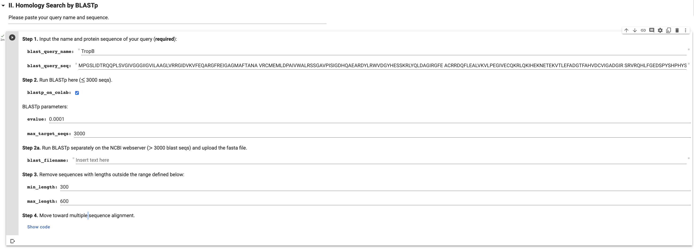
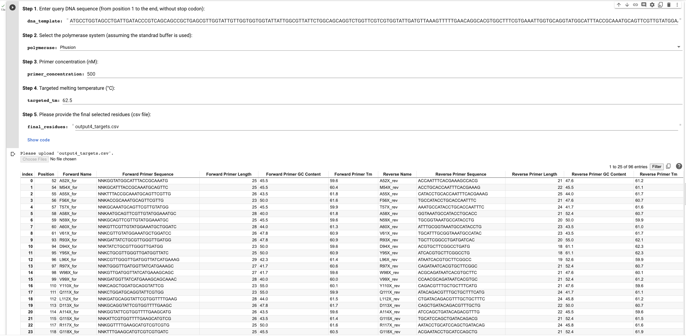
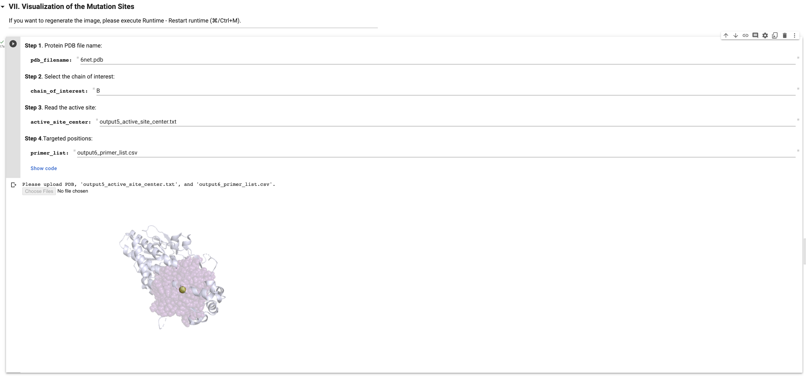

# `SSM_workflow`

## General:

The workflow is used for site-saturation mutagenesis (SSM) library preparation, designed to hugely decrease the time effort potential users put into when preparing SSM libraries.

The workflow enables:

- Determination of *N* mutation sites for the SSM targeting activity enrichment for your protein of interest
- Generation of *N* primer pairs ready for order

Users need to prepare three items in advance:

- Protein structure/model
- Protein sequence
- Gene sequence

There are multiple ways to create SSM libraries. This workflow follows our in-house SSM protocol and was primarily designed for it. Our SSM method works reasonably fine and robustly. If you are using your own in-house method to create SSM libraries, the workflow might not accommodate it. However, you are still welcome to modify the codes to fit you own needs.

[Running `SSM_workflow` in Google Colab](https://colab.research.google.com/drive/1EpV37cbThBZ0HcOOblgUYhhWPXHYe2YD?usp=sharing)

The `SSM_workflow`

The **SSM_workflow streamlines and automates steps for preparing a SSM library**, as detailed below. The concept of the workflow is that for people who want to evolve their protein of interest using SSM can start from the structure or model of that protein and quickly access all primers for the SSM library. At this moment, the workflow can be only used for directed evolution targeting activity but can be extended to target solubility as well if there is a requirement. 

1. Homology search by BLASTp
2. Multiple sequence alignment (MSA)
3. Residue conservation calculation
4. Mutation site selection focused around the user-defined active site
5. Primer generation for all mutation sites in SSM
6. Mutation site visualization in PyMol

**Run the SSM primer generator separately from the workflow:**

If you already know which sites to mutate (or want to include more sites) and come with their residue numbers, **we also provide an option to skip the entire workflow and only run a [single cell](https://colab.research.google.com/drive/1EpV37cbThBZ0HcOOblgUYhhWPXHYe2YD#scrollTo=-NNC0eIXvLEY&line=5&uniqifier=1) in Colab.**

**Multi-SDM primer generator:**

We provide another primer generator designed for **[Multi-SDM](https://colab.research.google.com/drive/1EpV37cbThBZ0HcOOblgUYhhWPXHYe2YD#scrollTo=ou2VFUVHODzg&line=3&uniqifier=1)**.

## Demo:

Here I will use TropB, which is a flavin-dependent monooxygenase, as an example to go through the whole SSM_workflow.

In my design, users need to run cells in sequential order (pressing the play button from top to down). In this demo, I will specify issues that you might face or need to be aware of during the process. Several steps will require you to upload files acquired from previous steps. However, uploading files is incorporated to avoid users from starting from the beginning everytime if your run is interrupted for somehow reasons. If you run the whole workflow consecutively and once you have uploaded files or have gotten files passed from the previous steps, you don't need to upload the files again theoretically.

***Step I:***
- "Install PyMol" may take minutes to complete and may report an error. You can ignore the error.

***Step II:***

- You can run Blastp directly on Colab if you target no more than 3000 homologous sequences. If you want to include more distantly homologous sequences (≥ 3000), it is recommended to do so directly on the NCBI website and download an unaligned blast file in fasta format.
- If you don't like to use Blastp, you can choose other blast functions in the NCBI website such as PSI-BLAST and again download the unaligned blast file in fasta format.

***Step III:***

- The default alignment method is MAFFT. Muscle3 is an alternative suitable for aligning less sequences and will generally take longer to run.

***Step IV:***

- In step IV, the conservation of each site of your query sequence will be calculated and you will also get four percentiles (5th, 10th, 90th, and 95th) to have references to define thresholds to include or exclude mutation sites.

***Step V:***

- In step V, you will be required to upload two files ("output3_res_conservation.csv" and structure/model file in pdb) and to specify mutation numbers, max distance (Å) around an active site, and lower/upper conservation threshold to include/exclude mutation sites.
- We provide two options to define the active site. You can either define the active site based on the ligand/substrate/cofactor or residue(s) known to be critical and conserved around the active site.
- In the demo, the crystal structure of the substrate-bound TropB is a dimer and we use the chain "B" and the bound substrate "KJY" to define TropB's active site.
- When you first run step V, a box will pop out to ask if you allow to download multiple files. Please select yes.

***Step VI:***

- In step VI, you will get an interactive table including all mutation sites, you can glean through it to check if there is any abnormal primer.

***Step VII:***

- You will get a figure in png with mutation sites labelled in purple and the center of the active site labelled in yellow.
- A pse file is also created at the same time so you can open it in PyMOL.

## References:

1. [PyMOL in Colab](https://github.com/MooersLab/colabpymolpysnips/tree/main)
2. *Proc. Natl. Acad. Sci. U.S.A.* **1998**, 95, 1460—1465. DOI: 10.1073/pnas.95.4.1460
3. *Biopolymers* **1965**, 3(2), 195−208. DOI: 10.1002/bip.360030207
4. *Biochemistry* **2004**, 43(12), 3537–3554. DOI: 10.1021/bi034621r

